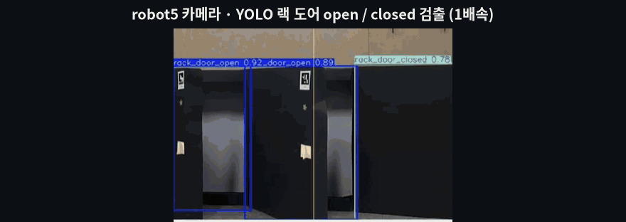
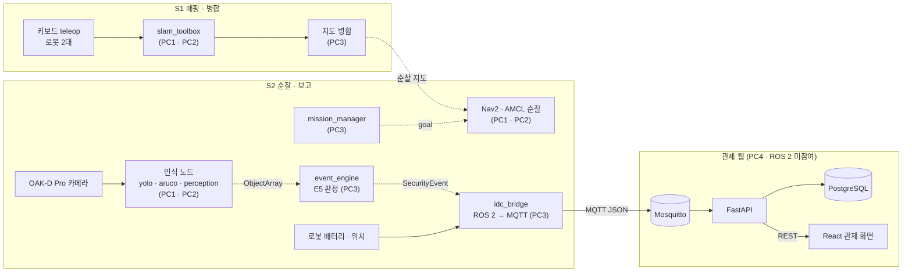

<div align="center">

# IDC 순찰 로봇 — TurtleBot4 2대 협동 순찰 MVP

**TurtleBot4 2대가 미니 IDC(랙 56기)를 순찰하며 열린 랙 도어는 YOLO로, 랙 번호는 ArUco 마커로 판별해 관제 웹에 보고하는 것을 목표로 한 팀 MVP입니다.**

<br>


<br>


<br>



<sub>▲ <b>앞부분</b> — 로봇 카메라 화면의 YOLO 랙 도어 검출(<code>rack_door_open</code> / <code>rack_door_closed</code>) · <b>뒷부분</b> — 로봇 2대가 나눠 주행하며 만든 SLAM 지도가 RViz에서 하나로 합쳐지는 모습</sub>

</div>

<br>

> [!NOTE]
> 이 저장소의 코드는 추후 정리 · 수정할 예정입니다.

<br>

## 프로젝트 개요

| 항목 | 내용 |
|---|---|
| 과정 | 두산로보틱스 ROKEY 9기 지능-1 프로젝트 — SLAM(위치 추정 · 지도 생성) 기반 자율주행 로봇 시스템 구현 |
| 주제 | 코로케이션 IDC 무인 시간대 AMR 순찰 · 랙 도어 개방 보고 |
| 기간 | 2026.09.04(주제 선정) ~ 2026.09.11(발표) · 약 1주 |
| 인원 | 8명 (C-2 · D-2조 합동) — PL 1 · PM 1 · Vision 2 · Sys 1 · AMR 3 |
| 내 역할 | **PM** (발표 역할표 기준) — 설계 문서 · 일정 · 데이터 → [My Role](#my-role--pm) |
| 하드웨어 | TurtleBot4 ×2 (OAK-D Pro 카메라 · RPLIDAR) · PC 4대 (로봇별 조종 PC 2 · 메인 서버 1 · 관제 웹 1) |
| 소프트웨어 | ROS 2 Jazzy · slam_toolbox · Nav2 · Ultralytics YOLO · OpenCV ArUco · MQTT(Mosquitto) · FastAPI · PostgreSQL · React |
| 테스트베드 | 3.5 m × 5.6 m 미니 IDC · 검은 폼보드 랙 모형 56기(7기 × 8줄) · 막다른 통로 4개(Z1~Z4) · 도크 2개 |

**배경** — IDC는 24시간 돌아가지만 야간 · 주말 상주 인력이 적어, 랙 도어가 열린 채로 몇 시간씩 방치될 수 있습니다. 수기 순찰 일지는 누락을 확인하기 어렵고, 보안상 도면 반출도 제한됩니다. 그래서 "로봇이 현장에서 직접 지도를 만들고, 그 지도로 순찰하며 열린 랙을 보고한다"는 흐름으로 기획했습니다.

<br>

## 시나리오

| 단계 | 내용 |
|---|---|
| **S1 매핑 · 병합** | 운영자가 키보드 teleop으로 로봇 2대를 서로 다른 구역에 몰아 각자 SLAM 지도를 만들고, 두 지도를 도크 위치 기준으로 하나의 순찰 지도로 합친다. |
| **S2 순찰 · 보고** | 로봇마다 구역 2개를 맡는다(robot11: Z1 → Z2, robot5: Z4 → Z3). 랙 앞 확인 좌표로 이동 → 랙 정면에서 3초 정지 · 응시 → YOLO로 도어 열림/닫힘, ArUco 마커로 랙 번호 판별 → 열린 랙은 E5 이벤트로 관제에 보고하고 순찰을 계속 → 끝나면 도크로 복귀한다. |

- **판정 규칙** — 한 프레임으로 정하지 않고 응시 구간의 다수결(open 10프레임 이상 · 60% 이상)로 확정하고, 같은 랙은 순찰 1회에 한 번만 보고한다.
- **마커가 안 보일 때** — 정면에서 기대한 랙의 마커가 안 보이면 열린 문이 마커를 가린 것으로 보고 개방으로 판정한다(`marker_missing`).
- S2는 끝까지 이어 붙이지 못했습니다. 어디까지 됐는지는 [결과](#결과-911-발표-기준)에 나눠 적었습니다.

<p align="center">
  <br>
  <sub>실측 도면으로 만든 테스트베드 정적 지도 — 랙 번호 01~56, 설계상 순찰 경로(주황: robot11 · 보라: robot5), 빨간 원 = 도크</sub>
</p>

<br>

## 시스템 아키텍처

PC 4대로 나눴습니다. 로봇별 조종 PC(PC1 · PC2)가 SLAM · Nav2 · 인식을, 메인 서버(PC3)가 지도 병합 · 미션 · 이벤트 판정을, 관제 웹 PC(PC4)가 MQTT · DB · 웹 화면을 맡습니다. PC4는 ROS 2에 참여하지 않고, 둘 사이 경계는 PC3의 `idc_bridge`(ROS 2 → MQTT)가 담당합니다.



<sub>실선 = 발표 영상이나 검증 기록으로 동작을 확인한 경로 · 점선 = 설계했지만 실기에서 이어서 동작한 기록이 없는 경로</sub>

- 순찰 지도는 설계상 S1 병합 지도입니다. 순찰 개발과 좌표 검증에는 실측 도면으로 만든 정적 지도와 랙 좌표 파일(`racks.yaml` — 랙 56기 · 구역 4 · 도크 2)을 따로 만들어 썼습니다([`src/idc_bringup/maps`](src/idc_bringup/maps/README.md)).
- 관제 경계 설계는 [`docs/adr/ADR-001-control-web-architecture.md`](docs/adr/ADR-001-control-web-architecture.md), MQTT 메시지 형식은 [`docs/mqtt_interface_v1.md`](docs/mqtt_interface_v1.md)에 있습니다.

<br>

## 패키지 구성

이 포크(main) 기준입니다.

| 패키지 | 내용 | main 상태 |
|---|---|---|
| `idc_msgs` | 팀 공통 메시지 4종 — `Object` · `ObjectArray`(현재 랙 1건의 도어 상태 · 랙 번호) · `MissionState` · `SecurityEvent`(E5) | 확정 |
| `idc_perception` | `yolo_node`(도어 open/closed) · `aruco_node`(랙 번호) · `perception_node`(화면 중앙 랙 1건으로 정리해 `ObjectArray` 발행) | 구현 · 실제 카메라로 기동 확인 |
| `idc_event` | `event_engine` — 응시 구간 다수결 또는 마커 미검출로 E5 확정, 순찰 1회에 랙당 1번 | 구현 · 합성 데이터 테스트만 |
| `idc_mission` | `patrol_planner`(`racks.yaml`의 순서대로 다음 랙 ID 발행) · `mission_manager` · `fleet_coordinator` · `dock_client` 등 | `patrol_planner` 외에는 골격 |
| `idc_bringup` | 실측 정적 지도 · `racks.yaml` 생성기, 공통 파라미터, launch | 통합 launch는 골격 |
| `idc_web` | `idc_bridge`(ROS 2 → MQTT) · `backend`(FastAPI · PostgreSQL · MQTT 수신) · `frontend`(React 관제 화면) | 텔레메트리 경로 검증(9/8) |
| `idc_entrance` · `idc_sim` | 확장용 빈 골격 | 빌드 제외 |

<br>

## 결과 (9/11 발표 기준)

구현에 성공한 범위가 넓지 않습니다. 발표 영상과 검증 기록으로 확인되는 것만 "된 것"에 넣었습니다.

### 된 것

| 기능 | 확인 근거 | 한계 |
|---|---|---|
| 로봇 2대가 구역을 나눠 teleop으로 동시에 SLAM 매핑, 두 지도를 한 좌표계로 합쳐 표시 | 발표 영상 (위 GIF 뒷부분) | 자율 탐사가 아니라 사람이 조종. 매핑 · 병합 코드는 팀 저장소 작업 브랜치에만 있음. 병합 지도로 순찰한 기록은 없음 |
| robot5 실제 카메라에서 랙 도어 open/closed YOLO 검출 | 발표 영상 (위 GIF 앞부분) | teleop 중 화면이며 순찰과 연동해 돌린 기록은 없음. 처리 속도 약 1.5~3.5 FPS로 목표(5 FPS 이상)에 못 미침 |
| 같은 실행에서 ArUco 마커로 랙 번호 인식 | 같은 영상의 노드 로그(`markers=[40, 39]`) | 인식률을 체계적으로 잰 기록은 없음 |
| 로봇 배터리 · 위치가 ROS 2 → MQTT → PostgreSQL → REST로 전달 | 9/8 단독 검증 [`docs/validation/SRV-02_…`](docs/validation/SRV-02_robot_telemetry_e2e_20260908.md) | 발표 시점 관제 화면에는 로봇 데이터가 들어오지 않음 |

### 축소 · 변경한 것

| 계획 | 바뀐 결과 | 이유 |
|---|---|---|
| 자율 탐사(frontier)로 지도 생성 | 사람이 teleop으로 구역을 나눠 매핑 | costmap 여유가 부족해 경로가 끊기고, 막다른 통로를 반복해서 고르고, 후진 회피가 안 됨 |
| 기성 실시간 지도 병합(`multirobot_map_merge`) | 도크 실측 위치 기준 자체 병합 스크립트 | 초기 위치가 어긋나고 오차가 쌓여 지도가 이중으로 겹침 |
| 이상 이벤트 2종(도어 개방 E5 + LED 이상 E7) | E5 1종 | 9/8 시나리오 개편 때 범위에서 뺌 |
| 증적 사진 저장 | 제외 | 9/10 메시지 정의 · 설계 문서 개정 때 범위에서 뺌 |
| 도어 학습 데이터 클래스당 200장 이상 | 전체 209장으로 마감 | 검은 랙이라 열림이 잘 안 보여 랙 안쪽에 흰 종이를 붙이고 다시 찍었고, 9/8 시나리오 변경으로 촬영을 처음부터 다시 함. AMR 통신 · 배터리 문제도 겹침 |

### 못 한 것

- **Nav2 순찰** — 저장 지도에서 랙마다 정지 · 3초 응시하며 도는 순찰은 코드(작업 브랜치)까지 있고, 실기 완주 · 자동 도킹 검증 기록이 없습니다.
- **미션 상태 머신 · 2대 순찰 조율** — main에는 골격만 있습니다.
- **이벤트 엔진을 실제 순찰에서 동작** — 합성 데이터 단위 테스트까지만 했습니다.
- **통합 시연** — 순찰 → 인식 → 이벤트 → 관제 화면으로 이어진 장면은 없습니다. 발표 관제 화면에는 지도 · 랙 표시와 인터페이스 문서의 예시와 같은 값의 이벤트만 있었고, 로봇 데이터는 들어오지 않았습니다.
- **YOLO 봉인 테스트셋 평가**

> **모델 수치에 대해** — 팀은 발표에서 YOLOv12n을 채택하고 검증 mAP50 0.92를 근거로 들었습니다. 이 값은 **검증셋 21장 기준 잠정값**이고, train/valid/test가 모두 같은 랙 줄(row01~04)의 사진에서 나와 **분할 누수 가능성**이 있으며, **봉인 테스트셋 평가는 하지 못했습니다.** 실제로 현장 rosbag에서는 기본 임계값(conf 0.5)으로 박스가 잘 나오지 않아 임계값을 낮춰 확인해야 했습니다.

<br>

## My Role — PM

최종 발표 역할표 기준 **PM(프로젝트 매니저)**으로 설계 문서 · 일정 · 데이터를 맡았습니다.
이 저장소의 코드와 커밋 · PR(`[PM]` 표기 포함)은 각 파트 담당 팀원이 올린 것입니다.

**설계 문서**
- 9/8 시나리오 개편(S1 매핑 · 병합 / S2 순찰 · 보고)에 맞춘 요구사항 · 설계 문서(BRD · SRD · SDD) 작성과 개정에 참여했습니다(PL · Sys 담당과 함께).

**일정**
- 시나리오가 바뀔 때 PL과 함께 일정을 다시 짰습니다.
- 통합 테스트 전에 파트별 단위 테스트 7개 항목(YOLO 모델 · 인식 노드 · 이벤트 엔진 · 서버/브리지 · Nav2 · 경로/미션 · 정지/회전/도킹)을 각 개발 작업 바로 뒤에 넣었습니다.

**데이터**
- 라벨링 환경(LabelImg)과 초기 라벨링 가이드 · 검수 규칙을 만들어 팀에 배포했습니다. 흰 종이를 붙여 다시 찍는 방식에 맞춘 최종 가이드(v3.0)는 PL이 전면 개정해 확정했습니다.
- 랙 도어 열림/닫힘 데이터 수집과 라벨링에 참여했습니다.

**모델**
- YOLOX nano · s 후보 모델 2종을 학습했습니다(Colab · 증강 없음 · 100 epoch). 최종 채택 모델은 YOLOv12n이고, 제가 학습한 후보는 채택되지 않았습니다.

<br>

## 팀 구성

발표 역할표 기준이며, 이름 대신 역할로 적었습니다.

| 역할 | 인원 | 담당 |
|---|:-:|---|
| PL | 1 | 프로젝트 총괄 · 개발 일정표 발행 · 승인, YOLO 학습 총괄, 시스템 통합 리드, ROS 2 인터페이스(`idc_msgs`) 확정, 코드 리뷰 최종 승인, 순찰 경로 생성기 |
| **PM (본인)** | 1 | 설계 문서 · 일정 · 데이터 → [My Role](#my-role--pm) |
| Vision | 2 | 테스트베드 구성, 데이터 수집 · 라벨링, ArUco 마커 제작, YOLO 모델 학습 |
| Sys | 1 | 관제 서버 · DB(FastAPI + PostgreSQL), 웹 UI(React), ROS 2–MQTT 브리지, 설계 문서 갱신, 순찰 경로 생성기, AMR 기능 단위 테스트 |
| AMR | 3 | 로봇 · PC 환경 설정, 수동 SLAM 매핑 · rosbag 녹화, 2대 지도 병합 · 정제, Nav2 파라미터 튜닝, AMR 기능 단위 테스트 |

<br>

## 배운 점

- **데이터는 모델보다 촬영 기준이 먼저다.** 처음 배포한 라벨링 가이드에는 박스 규칙만 있고 촬영 각도 · 거리 같은 수집 기준이 없었습니다. 검은 랙 문제와 겹쳐 데이터를 다시 모아야 했고, 그만큼 학습 기간이 줄었습니다. 다음에는 소량을 먼저 찍어 라벨링 · 학습까지 한 번 돌려 본 뒤 기준을 확정하겠습니다.
- **검증 점수는 분할부터 의심해야 한다.** 검증 mAP는 높았지만 현장 영상에서는 기본 임계값으로 박스가 잘 나오지 않았습니다. 분할 규칙이 문서에 있어도 실제 데이터셋에서 직접 확인해야 한다는 것을 배웠습니다.
- **통합은 일정 맨 끝에 두면 안 된다.** 9/8 시나리오 개편 뒤 남은 사흘 안에 단위 테스트와 통합을 모두 넣다 보니, 정지 · 회전 · 도킹 실기 단위 테스트는 시작하지 못했고 통합 시연까지 가지 못했습니다. 단위 테스트를 일정에 넣는 것만으로는 부족했고, 범위를 더 일찍 고정하고 파트 사이 연결부터 맞췄어야 했습니다.

<br>

## 저장소 구조 · 실행 안내

```text
rokey_idc_patrol/
├── src/
│   ├── idc_msgs/            메시지 4종
│   ├── idc_perception/      yolo_node · aruco_node · perception_node
│   ├── idc_event/           event_engine (E5 판정)
│   ├── idc_mission/         patrol_planner + 미션 노드 골격
│   ├── idc_bringup/         실측 정적 지도 · racks.yaml · launch
│   ├── idc_web/             idc_bridge · backend(FastAPI) · frontend(React)
│   └── idc_entrance/ · idc_sim/   확장용 골격 (빌드 제외)
├── tools/                   ArUco 마커 시트 생성 · 테스트용 발행기 · 이벤트 엔진 합성 테스트
├── docs/
│   ├── README_team.md       팀 원본 README (셋업 · 협업 규칙)
│   ├── adr/ · mqtt_interface_v1.md   관제 경계 설계
│   ├── runbook/             인식 · 이벤트 노드 현장 배치 절차
│   ├── validation/          관제 서버 텔레메트리 검증 (9/8)
│   └── images/              README 그림
├── .github/                 협업 규칙 · PR 템플릿 · CODEOWNERS
└── requirements.txt
```

- **빌드 · 셋업** — [`docs/README_team.md`](docs/README_team.md)(ROS 2 Jazzy · `colcon build`)를 따릅니다. 원본 README의 `idc_server`(Flask + SocketIO) 항목은 초기 골격 문구이고, 실제 관제 스택은 [`src/idc_web`](src/idc_web/README.md)의 FastAPI + PostgreSQL + MQTT + React입니다.
- **인식 · 이벤트 노드 현장 배치** — [`docs/runbook/PER-06_field_deploy.md`](docs/runbook/PER-06_field_deploy.md)
- **정적 지도 · 랙 좌표** — [`src/idc_bringup/maps/README.md`](src/idc_bringup/maps/README.md)
- 모델 가중치 · rosbag · 데이터셋은 팀 규칙에 따라 저장소에 넣지 않았습니다. 그래서 도어 검출은 이 저장소만으로는 재현되지 않습니다.

<br>

<div align="center">

**Doosan Robotics ROKEY 9기 · 지능-1 프로젝트 · 코로케이션 IDC AMR 순찰 시스템**

</div>
